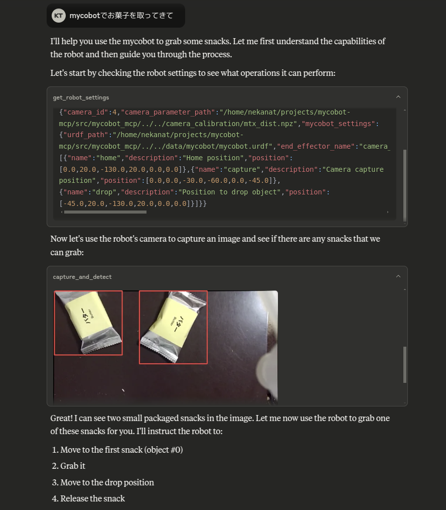

# myCobot MCP

## Overview

This project is a MCP server for myCobot.

This MCP can send simple pick-and-place instructions to myCobot.

> [!NOTE]
> This MCP server requires image feedback.
> Please connect an MCP client that can handle image feedback.

## Chat example



https://github.com/user-attachments/assets/e2c222b8-1ce2-4fb1-8b59-11ec5e973432

## Setup

### DDS API Token

This project uses the DDS API for object detection.
Please register and issue an API key for DDS.

https://cloud.deepdataspace.com/

### Claude-Desktop

If you want to run this project on Ubuntu, you can install Claude-Desktop from the following instructions.

https://github.com/aaddrick/claude-desktop-debian

Edit the `claude_desktop_config.json` file to add the following:

```json
{
  "mcpServers": {
    "mycobot": {
      "command": "uvx",
      "args": [
        "mycobot-mcp",
        "--settings-path",
        "/path/to/settings.json"
      ],
      "env": {
        "DDS_API_TOKEN": "your-api-token"
      }
    }
  }
}
```

Or you can clone this repository and run the following command.

```bash
git clone https://github.com/neka-nat/mycobot-mcp.git
```

```json
{
  "mcpServers": {
    "mycobot": {
      "command": "uv",
      "args": [
        "--directory",
        "/path/to/mycobot-mcp/",
        "run",
        "mycobot-mcp",
        "--settings-path",
        "/path/to/settings.json"
      ],
      "env": {
        "DDS_API_TOKEN": "your-api-token"
      }
    }
  }
}
```


### Hardware

This software assumes the following hardware configuration.

* [myCobot](https://shop.elephantrobotics.com/collections/mycobot/products/mycobot-worlds-smallest-and-lightest-six-axis-collaborative-robot)
* [suction-pump](https://shop.elephantrobotics.com/collections/suction-pumps/products/suction-pump-2-0)
* [camera-flange](https://shop.elephantrobotics.com/collections/camera-modules/products/camera-flange-2-0)


### Parameters

Create a `settings.json` file to configure the myCobot hardware and the camera.
The sample is [here](https://github.com/neka-nat/mycobot-mcp/blob/master/data/sample_settings.json).

```json
{
    "camera_id": 0,
    "pixel_size_on_capture_position": 0.00043,
    "mycobot_settings": {
        "urdf_path": "/path/to/mycobot.urdf",
        "end_effector_name": "camera_flange",
        "port": "/dev/ttyACM0",
        "baud": 115200,
        "default_speed": 40,
        "default_z_speed": 20,
        "suction_pin": 5,
        "command_timeout": 5,
        "use_gravity_compensation": false,
        "end_effector_height": 0.065,
        "object_height": 0.01,
        "release_height": 0.05,
        "places": [
            {
                "name": "home",
                "description": "Home position",
                "position": [0, 20, -130, 20, 0, 0]
            },
            {
                "name": "capture",
                "description": "Camera capture position",
                "position": [0, 0, -30, -60, 0, -45]
            },
            {
                "name": "drop",
                "description": "Position to drop object",
                "position": [-45, 20, -130, 20, 0, 0]
            }
        ]
    }
}
```

### Change port permission

When you connect mycobot, you need to change the permission.

```bash
sudo chmod 666 /dev/ttyACM0
```
